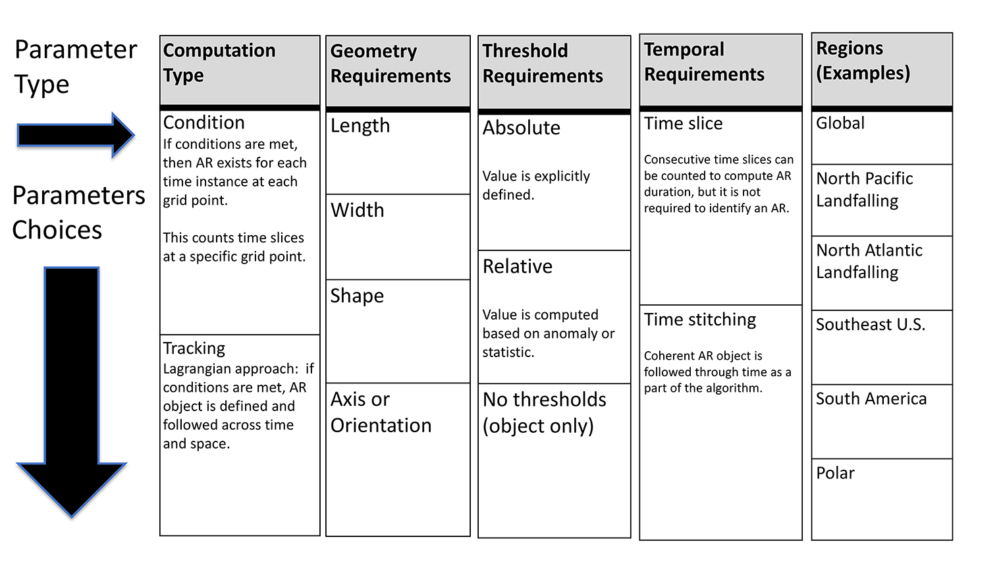
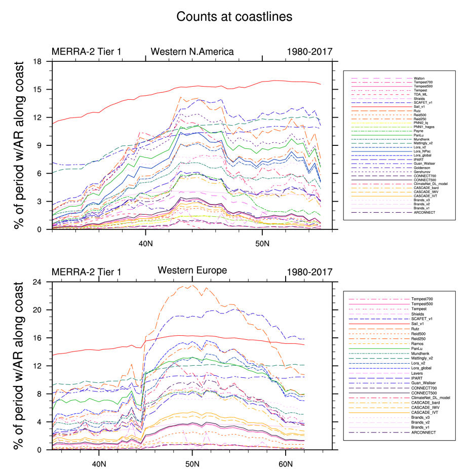

# Algorithms
Listed algorithms (A1, A2, etc.) have submitted catalogues for Tier 1. Algorithm numbering is determined by overall alphabetical order with the first set of numbers assigned to developers who participated in the 1-month proof of concept (A1 – A15), see [GMD paper](https://www.geosci-model-dev.net/11/2455/2018/gmd-11-2455-2018.pdf), followed by Tier 1-only participation (A16-39).

:::{figure-md} AlgoGrid
:width: 75%
:align: center

Algorithm Grid, by Christine Shields
:::

:::::{card} Alogrithms  (Click a name to veiw the alogrithm details)

::::{tab-set}

:::{tab-item} Brands et al
| Developer | Type | Geometry Req. | Threshold Req. | Temporal Req. | Region | DOI/Reference |
| --------- | ---- | ------------- | -------------- | ------------- | ------ | ------------- |
| Brands et al | Condition | > 1500 km | Both Relative and Absolute IVT: 95th(A16)/90th(A23)/90th(A24) percentile at point of detection, 90th/85th/85th percentile along the AR structure, consider all months for threshold calculation with a min threshold of 240/500/250 kgm-1s-1. Spatial tracking guided by vector IVT. | Time slice | 150°W to 30°E 30°N to 62°N | [10.1007/s00382-016-3095-6](https://doi.org/10.1007/s00382-016-3095-6) |
:::

:::{tab-item} Gershunov et alb
| Developer | Type | Geometry Req. | Threshold Req. | Temporal Req. | Region | DOI/Reference |
| --------- | ---- | ------------- | -------------- | ------------- | ------ | ------------- |
| Gershunov et alb | Condition and Track | >= 1500km long | Absolute: 250kgm-1s-1 IVT 1.5cm IWV | Time stitching -18 hours (3 time steps for 6 hourly data) | Western U.S. | [10.1002/2017GL074175](https://doi.org/10.1002/2017GL074175) | 
:::

:::{tab-item} Goldensonb
| Developer | Type | Geometry Req. | Threshold Req. | Temporal Req. | Region | DOI/Reference |
| --------- | ---- | ------------- | -------------- | ------------- | ------ | ------------- |
| Goldensonb | Condition | > 2000km long and < 1000km wide Object recognition | Absolute: 2cm IWV | Time slice | Western U.S. | [10.1175/JCLI-D-18-0268.1](https://doi.org/10.1175/JCLI-D-18-0268.1) | 
:::

:::{tab-item} Gorodetskaya et al
| Developer | Type | Geometry Req. | Threshold Req. | Temporal Req. | Region | DOI/Reference |
| --------- | ---- | ------------- | -------------- | ------------- | ------ | ------------- |
| Gorodetskaya et al | Condition | IWV > thresh. at the coast (within defined longitudinal sector) and continuously at all latitudes for ≥ 20° equatorward (length > 2000 km), within ± 15° longitude sector (width of 30° ~ 1000 km at 70°S; requirement of meridional extent) | Relative: aZN using IWV adjusted for reduced tropospheric moisture holding capacity at low temperatures (ARcoeff = 0.2) | Time slice | Polar (East Antarctica) | [10.1002/2014GL060881](https://doi.org/10.1002/2014GL060881) |
:::

:::{tab-item} Guan and Waliserbc
| Developer | Type | Geometry Req. | Threshold Req. | Temporal Req. | Region | DOI/Reference |
| --------- | ---- | ------------- | -------------- | ------------- | ------ | ------------- |
| Guan and Waliserbc | Condition | Length >2000km and length width ratio >2; Coherent IVT direction within 45° of AR shape orientation and with a poleward component | Relative: 85th percentile IVT; Absolute min requirement designed for polar locations: 100kgm-1s-1 IVT | Time slice | Global | [10.1002/2015JD024257](https://doi.org/10.1002/2015JD024257) [10.1175/JHM-D-17-0114.1](https://doi.org/10.1175/JHM-D-17-0114.1) [tracker code](https://dataverse.ucla.edu/dataverse/ar) | 
:::

:::{tab-item} Hagos et al.b (PNNL1)
| Developer | Type | Geometry Req. | Threshold Req. | Temporal Req. | Region | DOI/Reference |
| --------- | ---- | ------------- | -------------- | ------------- | ------ | ------------- |
| Hagos et al.b (PNNL1) | Condition | Dependent on threshold requirements to determine footprint; > 2000 km long and < 1000 km wide | Absolute: 2cm IWV 10ms-1 wind speed | Time slice | Western U.S. | [10.1175/JCLI-D-14-00567.1](https://doi.org/10.1175/JCLI-D-14-00567.1) | 
:::

:::{tab-item} Kashinath et al.f (ClimateNet)
| Developer | Type | Geometry Req. | Threshold Req. | Temporal Req. | Region | DOI/Reference |
| --------- | ---- | ------------- | -------------- | ------------- | ------ | ------------- |
| Kashinath et al.f (ClimateNet) | Condition | Deep learning based segmentation. Trained on ~500 expert labelled images | Threshold free; input fields are IWV, U850, V850, SLP | Time slice | Global | [10.5194/gmd-2020-72](https://doi.org/10.5194/gmd-2020-72) | 
:::

:::{tab-item} Krinitsky et al. (SAIL)
| Developer | Type | Geometry Req. | Threshold Req. | Temporal Req. | Region | DOI/Reference |
| --------- | ---- | ------------- | -------------- | ------------- | ------ | ------------- |
| Krinitsky et al. (SAIL) | Condition | Geometry reqirements Length >= 250km; Length-to-width >=5; Length is estimated along the "ridge" taking IVT into account. Width is the median of widths estimated in each point of AR ridge. | Relative: IVT-IVT_RM >_ 100. IVT_RM is climatological IVT running mean with 20-day windows | Time slice | Global |[10.1088/1755-1315/606/1/012011](https://iopscience.iop.org/article/10.1088/1755-1315/606/1/012011/meta)| 
:::

:::{tab-item} Lavers et al.
| Developer | Type | Geometry Req. | Threshold Req. | Temporal Req. | Region | DOI/Reference |
| --------- | ---- | ------------- | -------------- | ------------- | ------ | ------------- |
| Lavers et al. | Condition | 4.5° latitude movement allowed | Relative: ~85th percentile determined by evaluation of reanalysis products | Time slice | UK, Western US | [10.1029/2012JD018027](https://doi.org/10.1029/2012JD018027) |
:::

:::{tab-item} Leung and Qianb (PNNL2)
| Developer | Type | Geometry Req. | Threshold Req. | Temporal Req. | Region | DOI/Reference |
| --------- | ---- | ------------- | -------------- | ------------- | ------ | ------------- |
| Leung and Qianb (PNNL2) | Track |  Moisture flux has an eastward or northward component at landfall; tracks originating north of 25N and east of 140W are rejected | Absolute: mean IVT along track > 500 kgm-1s-1 and IVT at landfall > 200 kgm-1s-1; grid points up to 500km to the north and south along the AR tracks are included as part of the AR if their mean IVT > 300 kgm-1s-1 | Time slice | Western U.S. | [10.1029/2008GL036445](https://doi.org/10.1029/2008GL036445) | 
:::

:::{tab-item} Lora et al.b
| Developer | Type | Geometry Req. | Threshold Req. | Temporal Req. | Region | DOI/Reference |
| --------- | ---- | ------------- | -------------- | ------------- | ------ | ------------- |
| Lora et al.b | Condition | Length >= 2000km | <b>v1: Relative</b> : IVT 100kgm-1s-1 above climatological area means for N. Pacific; <b>v2:Relative/Absolute</b> : IVT 225 kgm-1s-1 above time/latitude dependent threshold using 30-day running mean and zonal average of IWV | Time slice | v1 Global (A6) v1 North Pacific (A7) v2 (Global) | [10.1002/2016GL071541](https://doi.org/10.1002/2016GL071541) [10.1016/j.epsl.2020.116293](https://doi.org/10.1016/j.epsl.2020.116293) | 
:::

:::{tab-item} Mahesh and O'Brien (CASCADE)
| Developer | Type | Geometry Req. | Threshold Req. | Temporal Req. | Region | DOI/Reference |
| --------- | ---- | ------------- | -------------- | ------------- | ------ | ------------- |
| Mahesh and O'Brien (CASCADE) | Condition | Convolutional neural network to replicate ARTMIP mean | Threshold-free; IVT(A25) and IWV (A26) is the input, output is probability of AR presence | Time slice | Global | Experimental | 
:::

:::{tab-item} Mahoney et al.
| Developer | Type | Geometry Req. | Threshold Req. | Temporal Req. | Region | DOI/Reference |
| --------- | ---- | ------------- | -------------- | ------------- | ------ | ------------- |
| Mahoney et al. | Condition and Track | Length >= 1500km, Width <=1500km | Absolute: ARDT-IVT 500kgm-1s-1 for SEUS. | See Wick | Southeast U.S. | [10.1175/MWR-D-15-0279.1](https://doi.org/10.1175/MWR-D-15-0279.1) (uses Wick) | 
:::

:::{tab-item} Mattingly
| Developer | Type | Geometry Req. | Threshold Req. | Temporal Req. | Region | DOI/Reference |
| --------- | ---- | ------------- | -------------- | ------------- | ------ | ------------- |
| Mattingly | Condition | Length >= 1500km; Length to width ratio > 1.5 | Relative: 85th percentile IVT (relative to 31 day centered climatological mean); Absolute min requirement designed for polar locations: 150 kg/m/s IVT: vIVT must be poleward unless feature is poleward of 66.56 N/S (Arctic/Antarctic Circle) | Time slice | Global coverage poleward of 10N/S; parameters tuned for polar focus (allows non poleward vIVT for features poleward of 66.56 N/S | [10.1029/2018JD028714](https://doi.org/10.1029/2018JD028714) | 
:::

:::{tab-item} Mundhenk
| Developer | Type | Geometry Req. | Threshold Req. | Temporal Req. | Region | DOI/Reference |
| --------- | ---- | ------------- | -------------- | ------------- | ------ | ------------- |
| Mundhenk | Condition | >1400km length, aspect ratio 1:4, lat limit >16N/S, axis orientation based on IVT | Relative IVT percentiles and/or anomalies both temporal and spatial | Time slice | Global | [10.1175/JCLI-D-15-0655.1](https://doi.org/10.1175/JCLI-D-15-0655.1) | 
:::

:::{tab-item} Muszynski et al. (ML_TDA)
| Developer | Type | Geometry Req. | Threshold Req. | Temporal Req. | Region | DOI/Reference |
| --------- | ---- | ------------- | -------------- | ------------- | ------ | ------------- |
| Muszynski et al. (ML_TDA) | Condition | Topological analysis and machine learned | Threshold-free | N/A | Western U.S., adaptable to other regions | [10.5194/gmd-12-613-2019](https://doi.org/10.5194/gmd-12-613-2019) | 
:::

:::{tab-item} Nellikkattil et al. (SCAFET)
| Developer | Type | Geometry Req. | Threshold Req. | Temporal Req. | Region | DOI/Reference |
| --------- | ---- | ------------- | -------------- | ------------- | ------ | ------------- |
| Nellikkattil et al. (SCAFET) | Condition and Track | Local geometric shape | Threshold free on IVT but precipitation > 1 mm/day | Time slice | Global | In preparation | 
:::

:::{tab-item} O'Brien et al. (teca_bard_v1.01 = CASCADE_bard_v1)
| Developer | Type | Geometry Req. | Threshold Req. | Temporal Req. | Region | DOI/Reference |
| --------- | ---- | ------------- | -------------- | ------------- | ------ | ------------- |
| O'Brien et al. (teca_bard_v1.01 = CASCADE_bard_v1) | Condition | eMinimum area | eRelative threshold (based on spatial percentile for each timestep). An inverted Gaussian filter is applied at the equator to damp out the ITCZ | Time slice | Global | [10.5194/gmd-13-6131-2020](https://doi.org/10.5194/gmd-13-6131-2020) | 
:::

:::{tab-item} PanLu
| Developer | Type | Geometry Req. | Threshold Req. | Temporal Req. | Region | DOI/Reference |
| --------- | ---- | ------------- | -------------- | ------------- | ------ | ------------- |
| PanLu | Condition | 1) Length>2000km;  2) Length-Width ratio>2;  3) sum of turning angle<360;  4) percentage within tropics < 95%;  5) 50% < percentage within tropics < 95% or percentage with IVT direction smaller than 15 degrees <50% | Two relative thresholds. Local threshold: smoothed 85% quantile IVT field using the Gaussian kernel density smoothing technique; regional threshold: the 80% quantile of IVT for all grids within 80N and 80S. | Time stitching: last for at least 18 hours | East Asia & Global | [10.1029/2018WR024407](https://doi.org/10.1029/2018WR024407) [10.1029/2020GL089477](https://doi.org/10.1029/2020GL089477) | 
:::

:::{tab-item} Payne and Magnusdottirbc
| Developer | Type | Geometry Req. | Threshold Req. | Temporal Req. | Region | DOI/Reference |
| --------- | ---- | ------------- | -------------- | ------------- | ------ | ------------- |
| Payne and Magnusdottirbc | Condition | Length > 1200km, landfalling only | Relative: 85th Percentile of maximum IVT (1000-500mb) Absolute: IWV >2cm, 850mb wind speed > 10m/s | Time stitching (12-hour minimum) | Western U.S. | [10.1002/2015JD023586](https://doi.org/10.1002/2015JD023586) [10.1002/2016JD025549](https://doi.org/10.1002/2016JD025549) | 
:::

:::{tab-item} Ralph et al.
| Developer | Type | Geometry Req. | Threshold Req. | Temporal Req. | Region | DOI/Reference |
| --------- | ---- | ------------- | -------------- | ------------- | ------ | ------------- |
| Ralph et al. | Condition | Length >= 2000km, Width <= 1000km | Absolute: IWV 2cm | Time slice | Western U.S. | [10.1175/1520-0493(2004)132](https://doi.org/10.1175/1520-0493(2004)132%3C1721:SACAOO%3E2.0.CO;2) | 
:::

:::{tab-item} Ramos et al.bc; Blamey et al.*
| Developer | Type | Geometry Req. | Threshold Req. | Temporal Req. | Region | DOI/Reference |
| --------- | ---- | ------------- | -------------- | ------------- | ------ | ------------- |
| Ramos et al.bc; Blamey et al.* | Condition | Detected for reference meridians, length >=1500km (1800km*), latitudinal movement <4.5°N | Relative: IVT 85th percentile (1000-300mb) | Time slice, but 18-hour minimum for persistent ARs | Western Europe, South Africa*, adaptable to other regions | [10.5194/esd-7-371-2016](https://doi.org/10.5194/esd-7-371-2016) [10.1175/JHM-D-17-0111.1](https://doi.org/10.1175/JHM-D-17-0111.1) | 
:::

:::{tab-item} Reid et al.
| Developer | Type | Geometry Req. | Threshold Req. | Temporal Req. | Region | DOI/Reference |
| --------- | ---- | ------------- | -------------- | ------------- | ------ | ------------- |
| Reid et al. | Condition | Length > 2000km; Length-Width ratio > 2; orientation angle >10° | = Absolute. IVT > 250 kg/m/s; IVT > 500 kg/m/s | Time slice | Global | [10.1029/2020JD032897](https://doi.org/10.1029/2020JD032897) | 
:::

:::{tab-item} Rutz et al.b
| Developer | Type | Geometry Req. | Threshold Req. | Temporal Req. | Region | DOI/Reference |
| --------- | ---- | ------------- | -------------- | ------------- | ------ | ------------- |
| Rutz et al.b | Condition | Length >= 2000km | Absolute: IVT (surface to 100mb) = 250kgm-1s-1 | Time slice | Global, low value on tropics | [10.1175/MWR-D-13-00168.1](https://doi.org/10.1175/MWR-D-13-00168.1) | 
:::

:::{tab-item} Shearer et al.(AR-CONNECT)
| Developer | Type | Geometry Req. | Threshold Req. | Temporal Req. | Region | DOI/Reference |
| --------- | ---- | ------------- | -------------- | ------------- | ------ | ------------- |
| Shearer et al.(AR-CONNECT) | Track | Object identification | Absolute: Absolute: IVT thresholds used = 700 for seeding, 300, for region growing | Time stitching, minimum 24-hour period | Global weighted centroid of AR event must be outside tropics (23.25 N - 23.25 S) | [10.1029/2020JD033425](https://doi.org/10.1029/2020JD033425) | 
:::

:::{tab-item} Sellars et al.b (CONNECT)
| Developer | Type | Geometry Req. | Threshold Req. | Temporal Req. | Region | DOI/Reference |
| --------- | ---- | ------------- | -------------- | ------------- | ------ | ------------- |
| Sellars et al.b (CONNECT) | Track | Object identification | Absolute: IVT, thresholds tested = 300 (A11), 500 (A12), 700 (A13) kgm-1s-1 | Time stitching, minimum 24-hour period | Global | [10.1002/2013EO320001](https://doi.org/10.1002/2013EO320001) [10.1175/JHM-D-14-0101.1](https://doi.org/10.1175/JHM-D-14-0101.1) | 
:::

:::{tab-item} Shields and Kiehlb
| Developer | Type | Geometry Req. | Threshold Req. | Temporal Req. | Region | DOI/Reference |
| --------- | ---- | ------------- | -------------- | ------------- | ------ | ------------- |
| Shields and Kiehlb | Condition | Ratio 2:1, length to width grid points min 200km length; 850mb wind direction from specified regional quadrants, landfalling only | Relative: aZN moisture threshold using IWV; Wind threshold defined by regional 85th percentile 850mb wind magnitudes | Time slice | Western U.S. Iberian Peninsula, UK, adaptable but regional specific | [10.1002/2016GL069476](https://doi.org/10.1002/2016GL069476) [10.1002/2016GL070470](https://doi.org/10.1002/2016GL070470) | 
:::

:::{tab-item} TEMPESTb
| Developer | Type | Geometry Req. | Threshold Req. | Temporal Req. | Region | DOI/Reference |
| --------- | ---- | ------------- | -------------- | ------------- | ------ | ------------- |
| TEMPESTb	 | Track | dLaplacian IVT thresholds most effective for widths >1000km; cluster size minimum = 120000km2 | dIVT >=250kgm-1s-1 | Time stitching | Global, but latitude >=15° | [10.1029/2020JD033421](https://doi.org/10.1029/2020JD033421) [10.5194/gmd-10-1069-2017](https://doi.org/10.5194/gmd-10-1069-2017) [10.1029/2019JD031977](https://doi.org/10.1029/2019JD031977) [10.1029/2020JD033421](https://doi.org/10.1029/2020JD033421) | 
:::

:::{tab-item} Viale et al.
| Developer | Type | Geometry Req. | Threshold Req. | Temporal Req. | Region | DOI/Reference |
| --------- | ---- | ------------- | -------------- | ------------- | ------ | ------------- |
| Viale et al. | Condition | Length >2000km (>1500km north of 35°S) and length-width ratio>2; Coherent IVT direction within 45° of AR mean direction and with a poleward component | Relative: 85th percentile IVT; Absolute min requirement designed for subtropical locations: 100kgm-1s-1 IVT; a frontal zone intercept or locate south (up to 50 km), i.e., mag. of the horizontal gradient of the 1000-850hPa thickness > 5 m 100 km-1) | Time slice | Southwestern South America | [10.1175/JHM-D-18-0006.1](https://doi.org/10.1175/JHM-D-18-0006.1) | 
:::

:::{tab-item} Walton et al.
| Developer | Type | Geometry Req. | Threshold Req. | Temporal Req. | Region | DOI/Reference |
| --------- | ---- | ------------- | -------------- | ------------- | ------ | ------------- |
| Walton et al. | Condition and Track | Length >= 2000 km | Relative: IVT > 250 kg/m/s + daily IVT climatology | Time stitching, minimum 24-hour period | Western U.S. | Experimental | 
:::

:::{tab-item} Wick et al.
| Developer | Type | Geometry Req. | Threshold Req. | Temporal Req. | Region | DOI/Reference |
| --------- | ---- | ------------- | -------------- | ------------- | ------ | ------------- |
| Wick et al. | Condition and Track | >=2000km long, <= 1000km wide object identification involving shape and axis | Absolute: ARDT-IWV >2cm | Time slice and stitching | Regional | [10.1109/TGRS.2012.2211024](https://doi.org/10.1109/TGRS.2012.2211024) |
:::

:::{tab-item} Wille et al.
| Developer | Type | Geometry Req. | Threshold Req. | Temporal Req. | Region | DOI/Reference |
| --------- | ---- | ------------- | -------------- | ------------- | ------ | ------------- |
| Wille et al. | Condition | Length > 20° (2000 km) equatorward with no breaks. Defined as AR landfall if AR shape overlaps a land grid cell. | Relative > 98th percentile IWV(A28) or vIVT(29) based on monthly climatological means | Time slice | Polar: Antarctic(37.5°-78°S; Arctic(37.5°-80°N | [Antarctic 10.1029/2020JD033788](https://doi.org/10.1029/2020JD033788) Arctic: Experimental | 
:::

:::{tab-item} Xu et al. (IPART)
| Developer | Type | Geometry Req. | Threshold Req. | Temporal Req. | Region | DOI/Reference |
| --------- | ---- | ------------- | -------------- | ------------- | ------ | ------------- |
| Xu et al. (IPART) | Condition and Track | Length >= 1500 km, area in range [50&#42;104, 1800&#42;104 km2], L/W ratio>=2, isoperimetric quotient < 0.7, centroid latitude > 20 N, < 80 N. | Threshold free;Select transient IVT plumes standing out from a temporal scale of 8 days;Spatial scale of ~ 1000 km | Time slice and stitching | Northern Hemisphere | [10.5194/gmd-13-4639-2020](https://doi.org/10.5194/gmd-13-4639-2020) | 
:::

:::{tab-item} Zhang, Tung, & Clevelandg (Purdue)
| Developer | Type | Geometry Req. | Threshold Req. | Temporal Req. | Region | DOI/Reference |
| --------- | ---- | ------------- | -------------- | ------------- | ------ | ------------- |
| Zhang, Tung, & Clevelandg (Purdue) | Multifactorial Conditions and Track | (Length >= 1500, 1800, OR 2000 km) AND (Length/average Width >= 2) | Relative: (75th, 85th, OR 95th monthly percentile applied at every gridpoint, in ENSO neutral and weak ENSO years) (IVT, IWV, OR IVT+IWV) | (Persistent Duration >=12, 18, OR 24 hours) AND (Break < 24 hours) | Regional: West-Coast landfalling region: located between 33-48.5N and 124.375-114.375W; Midwest region is between 37-47N and 94-84W | [10.1029/2020JD033667](https://doi.org/10.1029/2020JD033667) |
:::

::::

:::::

<!--- A TEMPLATE

:::{tab-item} ***TAB NAME***
| Developer | Type | Geometry Req. | Threshold Req. | Temporal Req. | Region | DOI/Reference |
| --------- | ---- | ------------- | -------------- | ------------- | ------ | ------------- |
|           |      |               |                |               |        |               |
:::

\--->

<!---
:::{table} Algorithms
:label: table
:align: center
  
| Developer | Type | Geometry Req. | Threshold Req. | Temporal Req. | Region | DOI/Reference |
| --------- | ---- | ------------- | -------------- | ------------- | ------ | ------------- |
| Brands et al | Condition | 
 

 > 1500 km 
 | 
 

 Both Relative and Absolute IVT: 95th(A16)/90th(A23)/90th(A24) percentile at point of detection, 90th/85th/85th percentile along the AR structure, consider all months for threshold calculation with a min threshold of 240/500/250 kgm-1s-1. Spatial tracking guided by vector IVT. 
 | 
 

 Time slice 
 | 
 

 150°W to 30°E 30°N to 62°N 
 | 
 

 [10.1007/s00382-016-3095-6](https://doi.org/10.1007/s00382-016-3095-6) 
 |
| Gershunov et alb | Condition and Track | 
 

 >= 1500km long 
 | 
 

 Absolute: 250kgm-1s-1 IVT 1.5cm IWV 
 | Time stitching -18 hours (3 time steps for 6 hourly data) | Western U.S. | [10.1002/2017GL074175](https://doi.org/10.1002/2017GL074175) | 
| Goldensonb | Condition | 
 

 > 2000km long and < 1000km wide Object recognition 
 | 
 

 Absolute: 2cm IWV 
 | Time slice | Western U.S. | [10.1175/JCLI-D-18-0268.1](https://doi.org/10.1175/JCLI-D-18-0268.1) | 
| Gorodetskaya et al | Condition | 
 

 IWV > thresh. at the coast (within defined longitudinal sector) and continuously at all latitudes for ≥ 20° equatorward (length > 2000 km), within ± 15° longitude sector (width of 30° ~ 1000 km at 70°S; requirement of meridional extent) 
 | 
 

 Relative: aZN using IWV adjusted for reduced tropospheric moisture holding capacity at low temperatures (ARcoeff = 0.2) 
 | Time slice | Polar (East Antarctica) | [10.1002/2014GL060881](https://doi.org/10.1002/2014GL060881) |
| Guan and Waliserbc | Condition | 
 
G.R.
 Length >2000km and length width ratio >2; Coherent IVT direction within 45° of AR shape orientation and with a poleward component 
 | 
 
T.R.
 Relative: 85th percentile IVT; Absolute min requirement designed for polar locations: 100kgm-1s-1 IVT 
 | Time slice | Global | [10.1002/2015JD024257](https://doi.org/10.1002/2015JD024257) [10.1175/JHM-D-17-0114.1](https://doi.org/10.1175/JHM-D-17-0114.1) [tracker code](https://dataverse.ucla.edu/dataverse/ar) | 
| Hagos et al.b (PNNL1) | Condition | 
 

 Dependent on threshold requirements to determine footprint; > 2000 km long and < 1000 km wide 
 | 
 

 Absolute: 2cm IWV 10ms-1 wind speed 
 | Time slice | Western U.S. | [10.1175/JCLI-D-14-00567.1](https://doi.org/10.1175/JCLI-D-14-00567.1) | 
| Kashinath et al.f (ClimateNet) | Condition | 
 

 Deep learning based segmentation. Trained on ~500 expert labelled images 
 | 
 

 Threshold free; input fields are IWV, U850, V850, SLP 
 | Time slice | Global | [10.5194/gmd-2020-72](https://doi.org/10.5194/gmd-2020-72) | 
| Krinitsky et al. (SAIL) | Condition | 
 

 Geometry reqirements Length >= 250km; Length-to-width >=5; Length is estimated along the "ridge" taking IVT into account. Width is the median of widths estimated in each point of AR ridge. 
 | 
 

 Relative: IVT-IVT_RM >_ 100. IVT_RM is climatological IVT running mean with 20-day windows 
 | Time slice | Global |[10.1088/1755-1315/606/1/012011](https://iopscience.iop.org/article/10.1088/1755-1315/606/1/012011/meta)| 
| Lavers et al. | Condition | 
 

 4.5° latitude movement allowed | 
 

 Relative: ~85th percentile determined by evaluation of reanalysis products | Time slice | UK, Western US | [10.1029/2012JD018027](https://doi.org/10.1029/2012JD018027) | 
|
 
Leung and Qianb (PNNL2)
 Leung and Qianb (PNNL2) | Track | 
 

 Moisture flux has an eastward or northward component at landfall; tracks originating north of 25N and east of 140W are rejected 
 | 
 

 Absolute: mean IVT along track > 500 kgm-1s-1 and IVT at landfall > 200 kgm-1s-1; grid points up to 500km to the north and south along the AR tracks are included as part of the AR if their mean IVT > 300 kgm-1s-1 
 | Time slice | Western U.S. | [10.1029/2008GL036445](https://doi.org/10.1029/2008GL036445) 
| 
| Lora et al.b | Condition | Length >= 2000km | <b>v1: Relative</b> : IVT 100kgm-1s-1 above climatological area means for N. Pacific; <b>v2:Relative/Absolute</b> : IVT 225 kgm-1s-1 above time/latitude dependent threshold using 30-day running mean and zonal average of IWV | Time slice | v1 Global (A6) v1 North Pacific (A7) v2 (Global) | [10.1002/2016GL071541](https://doi.org/10.1002/2016GL071541) [10.1016/j.epsl.2020.116293](https://doi.org/10.1016/j.epsl.2020.116293) | 
| Mahesh and O'Brien (CASCADE) | Condition | Convolutional neural network to replicate ARTMIP mean | Threshold-free; IVT(A25) and IWV (A26) is the input, output is probability of AR presence | Time slice | Global | Experimental | 
| Mahoney et al. | Condition and Track | Length >= 1500km, Width <=1500km | Absolute: ARDT-IVT 500kgm-1s-1 for SEUS. | See Wick | Southeast U.S. | [10.1175/MWR-D-15-0279.1](https://doi.org/10.1175/MWR-D-15-0279.1) (uses Wick) | 
| Mattingly | Condition | Length >= 1500km; Length to width ratio > 1.5 | Relative: 85th percentile IVT (relative to 31 day centered climatological mean); Absolute min requirement designed for polar locations: 150 kg/m/s IVT: vIVT must be poleward unless feature is poleward of 66.56 N/S (Arctic/Antarctic Circle) | Time slice | Global coverage poleward of 10N/S; parameters tuned for polar focus (allows non poleward vIVT for features poleward of 66.56 N/S | [10.1029/2018JD028714](https://doi.org/10.1029/2018JD028714) | 
| Mundhenk | Condition | >1400km length, aspect ratio 1:4, lat limit >16N/S, axis orientation based on IVT | Relative IVT percentiles and/or anomalies both temporal and spatial | Time slice | Global | [10.1175/JCLI-D-15-0655.1](https://doi.org/10.1175/JCLI-D-15-0655.1) | 
| Muszynski et al. (ML_TDA) | Condition | Topological analysis and machine learned | Threshold-free | N/A | Western U.S., adaptable to other regions | [10.5194/gmd-12-613-2019](https://doi.org/10.5194/gmd-12-613-2019) | 
| Nellikkattil et al. (SCAFET) | Condition and Track | Local geometric shape | Threshold free on IVT but precipitation > 1 mm/day | Time slice | Global | In preparation | 
| O'Brien et al. (teca_bard_v1.01 = CASCADE_bard_v1) | Condition | eMinimum area | eRelative threshold (based on spatial percentile for each timestep). An inverted Gaussian filter is applied at the equator to damp out the ITCZ | Time slice | Global | [10.5194/gmd-13-6131-2020](https://doi.org/10.5194/gmd-13-6131-2020) | 
| PanLu | Condition | 1) Length>2000km;  2) Length-Width ratio>2;  3) sum of turning angle<360;  4) percentage within tropics < 95%;  5) 50% < percentage within tropics < 95% or percentage with IVT direction smaller than 15 degrees <50% | Two relative thresholds. Local threshold: smoothed 85% quantile IVT field using the Gaussian kernel density smoothing technique; regional threshold: the 80% quantile of IVT for all grids within 80N and 80S. | Time stitching: last for at least 18 hours | East Asia & Global | [10.1029/2018WR024407](https://doi.org/10.1029/2018WR024407) [10.1029/2020GL089477](https://doi.org/10.1029/2020GL089477) | 
| Payne and Magnusdottirbc | Condition | Length > 1200km, landfalling only | Relative: 85th Percentile of maximum IVT (1000-500mb) Absolute: IWV >2cm, 850mb wind speed > 10m/s | Time stitching (12-hour minimum) | Western U.S. | [10.1002/2015JD023586](https://doi.org/10.1002/2015JD023586) [10.1002/2016JD025549](https://doi.org/10.1002/2016JD025549) | 
| Ralph et al. | Condition | Length >= 2000km, Width <= 1000km | Absolute: IWV 2cm | Time slice | Western U.S. | [10.1175/1520-0493(2004)132](https://doi.org/10.1175/1520-0493(2004)132%3C1721:SACAOO%3E2.0.CO;2) | 
| Ramos et al.bc; Blamey et al.* | Condition | Detected for reference meridians, length >=1500km (1800km*), latitudinal movement <4.5°N | Relative: IVT 85th percentile (1000-300mb) | Time slice, but 18-hour minimum for persistent ARs | Western Europe, South Africa*, adaptable to other regions | [10.5194/esd-7-371-2016](https://doi.org/10.5194/esd-7-371-2016) [10.1175/JHM-D-17-0111.1](https://doi.org/10.1175/JHM-D-17-0111.1) | 
| Reid et al. | Condition | Length > 2000km; Length-Width ratio > 2; orientation angle >10° | = Absolute. IVT > 250 kg/m/s; IVT > 500 kg/m/s | Time slice | Global | [10.1029/2020JD032897](https://doi.org/10.1029/2020JD032897) | 
| Rutz et al.b | Condition | Length >= 2000km | Absolute: IVT (surface to 100mb) = 250kgm-1s-1 | Time slice | Global, low value on tropics | [10.1175/MWR-D-13-00168.1](https://doi.org/10.1175/MWR-D-13-00168.1) | 
| Shearer et al.(AR-CONNECT) | Track | Object identification | Absolute: Absolute: IVT thresholds used = 700 for seeding, 300, for region growing | Time stitching, minimum 24-hour period | Global weighted centroid of AR event must be outside tropics (23.25 N - 23.25 S) | [10.1029/2020JD033425](https://doi.org/10.1029/2020JD033425) | 
| Sellars et al.b (CONNECT) | Track | Object identification | Absolute: IVT, thresholds tested = 300 (A11), 500 (A12), 700 (A13) kgm-1s-1 | Time stitching, minimum 24-hour period | Global | [10.1002/2013EO320001](https://doi.org/10.1002/2013EO320001) [10.1175/JHM-D-14-0101.1](https://doi.org/10.1175/JHM-D-14-0101.1) | 
| Shields and Kiehlb | Condition | Ratio 2:1, length to width grid points min 200km length; 850mb wind direction from specified regional quadrants, landfalling only | Relative: aZN moisture threshold using IWV; Wind threshold defined by regional 85th percentile 850mb wind magnitudes | Time slice | Western U.S. Iberian Peninsula, UK, adaptable but regional specific | [10.1002/2016GL069476](https://doi.org/10.1002/2016GL069476) [10.1002/2016GL070470](https://doi.org/10.1002/2016GL070470) | 
| TEMPESTb	 | Track | dLaplacian IVT thresholds most effective for widths >1000km; cluster size minimum = 120000km2 | dIVT >=250kgm-1s-1 | Time stitching | Global, but latitude >=15° | [10.1029/2020JD033421](https://doi.org/10.1029/2020JD033421) [10.5194/gmd-10-1069-2017](https://doi.org/10.5194/gmd-10-1069-2017) [10.1029/2019JD031977](https://doi.org/10.1029/2019JD031977) [10.1029/2020JD033421](https://doi.org/10.1029/2020JD033421) | 
| Viale et al. | Condition | Length >2000km (>1500km north of 35°S) and length-width ratio>2; Coherent IVT direction within 45° of AR mean direction and with a poleward component | Relative: 85th percentile IVT; Absolute min requirement designed for subtropical locations: 100kgm-1s-1 IVT; a frontal zone intercept or locate south (up to 50 km), i.e., mag. of the horizontal gradient of the 1000-850hPa thickness > 5 m 100 km-1) | Time slice | Southwestern South America | [10.1175/JHM-D-18-0006.1](https://doi.org/10.1175/JHM-D-18-0006.1) | 
| Walton et al. | Condition and Track | Length >= 2000 km | Relative: IVT > 250 kg/m/s + daily IVT climatology | Time stitching, minimum 24-hour period | Western U.S. | Experimental | 
| Wick et al. | Condition and Track | >=2000km long, <= 1000km wide object identification involving shape and axis | Absolute: ARDT-IWV >2cm | Time slice and stitching | Regional | [10.1109/TGRS.2012.2211024](https://doi.org/10.1109/TGRS.2012.2211024) |
| Wille et al. | Condition | Length > 20° (2000 km) equatorward with no breaks. Defined as AR landfall if AR shape overlaps a land grid cell. | Relative > 98th percentile IWV(A28) or vIVT(29) based on monthly climatological means | Time slice | Polar: Antarctic(37.5°-78°S; Arctic(37.5°-80°N | [Antarctic 10.1029/2020JD033788](https://doi.org/10.1029/2020JD033788) Arctic: Experimental | 
| Xu et al. (IPART) | Condition and Track | Length >= 1500 km, area in range [50&#42;104, 1800&#42;104 km2], L/W ratio>=2, isoperimetric quotient < 0.7, centroid latitude > 20 N, < 80 N. | Threshold free;Select transient IVT plumes standing out from a temporal scale of 8 days;Spatial scale of ~ 1000 km | Time slice and stitching | Northern Hemisphere | [10.5194/gmd-13-4639-2020](https://doi.org/10.5194/gmd-13-4639-2020) | 
| Zhang, Tung, & Clevelandg (Purdue) | Multifactorial Conditions and Track | (Length >= 1500, 1800, OR 2000 km) AND (Length/average Width >= 2) | Relative: (75th, 85th, OR 95th monthly percentile applied at every gridpoint, in ENSO neutral and weak ENSO years) (IVT, IWV, OR IVT+IWV) | (Persistent Duration >=12, 18, OR 24 hours) AND (Break < 24 hours) | Regional: West-Coast landfalling region: located between 33-48.5N and 124.375-114.375W; Midwest region is between 37-47N and 94-84W | [10.1029/2020JD033667](https://doi.org/10.1029/2020JD033667) |
:::
/--->

aZN relative threshold formula: <math>Q >= Qzonal_mean + ARcoeff (Qzonalmax – Qzonamean)</math> where Q = moisture variable, either IVT (kg m-1s-1) or IWV(cm). ARcoeff = 0.3 except where noted (Zhu and Newell, 1998). The Gorodetskaya method uses Qsat, where Qsat represents maximum moisture holding capacity calculated based on temperature (Clausius-Clapeyron), an important distinction for polar ARs. Additional analysis on the ZN method can be found in Newman et al., 201

bMethods used in a 1-month proof-of-concept test (Section 5). These methods are assigned an algorithm id, i.e. A1, A2, etc.

cThese 1-month proof-of-concept methods apply a percentile approach to determining ARs. A3 and A8 applied the full MERRA2 climatology to compute percentiles. A9, applied the Feb 2017 climatology for this test only. For the full catalogues, A9 will apply extended winter and extended summer climatologies to compute percentiles. Please refer to individual publications (DOI reference column in this table) for climatologies used in earlier published studies by each developer. The climatology used to compute percentile is often dependent on the dataset (re-analysis or model data) being used.

dTempest contains both an absolute threshold (typically set at IVT>250) and a relative threshold (which uses a local Laplacian of IVT, typically set at del2 IVT < -50k).

eThe O’Brien et al. Bayesian AR Detector (BARD) algorithm runs 1,024 AR detectors simultaneously. Percentile threshold, minimum area, and filter latitude width are all sampled from a posterior distribution that is designed to optimize global AR counts relative to a dataset of AR counts from a set of experts.

fThe DL model presented in the paper and the one used to produce the catalogue use slightly different architectures (DeepLab3+ vs CGNet)

gThe Purdue indices consist of 81 indices for the land-falling West-Coast ARs and 81 indices for the inland Midwest ARs.

:::{figure-md}
:width: 75%
:align: center

ARTMIP AR Detection Tool (ARDT) Occurrences for Tier1 participants using MERRA-2 reanalysis data (1980-2017). Metrics are computed at coastline locations for Western North American (upper panel) and Western Europe (lower panel) and plotted by latitude to illustrate AR frequency differences solely due to ARDT. Key is given to the right of each panel for available algorithms shown on this page. Units are given in percent of ARs that occur at the coastline during MERRA-2 sample period. 
ARTMIP Tier1 catalogues, figure creation C.Shields (Supplemental figure S3 Shields, Payne, et al 2023) [This Page](algorithms.md) and <https://www.earthsystemgrid.org/dataset/ucar.cgd.artmip.html>
:::

