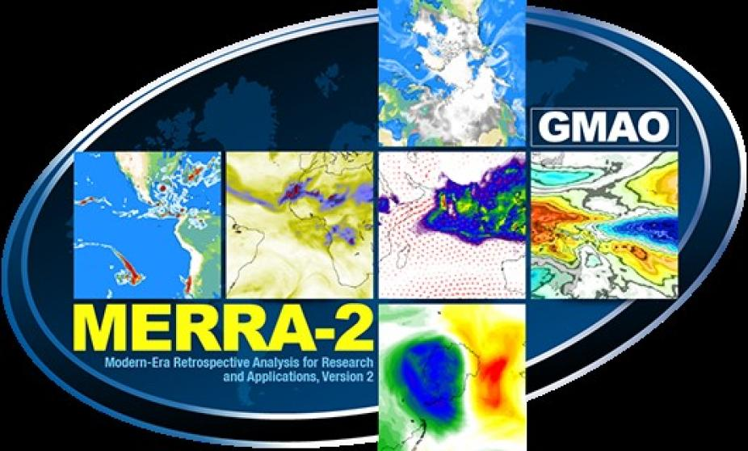
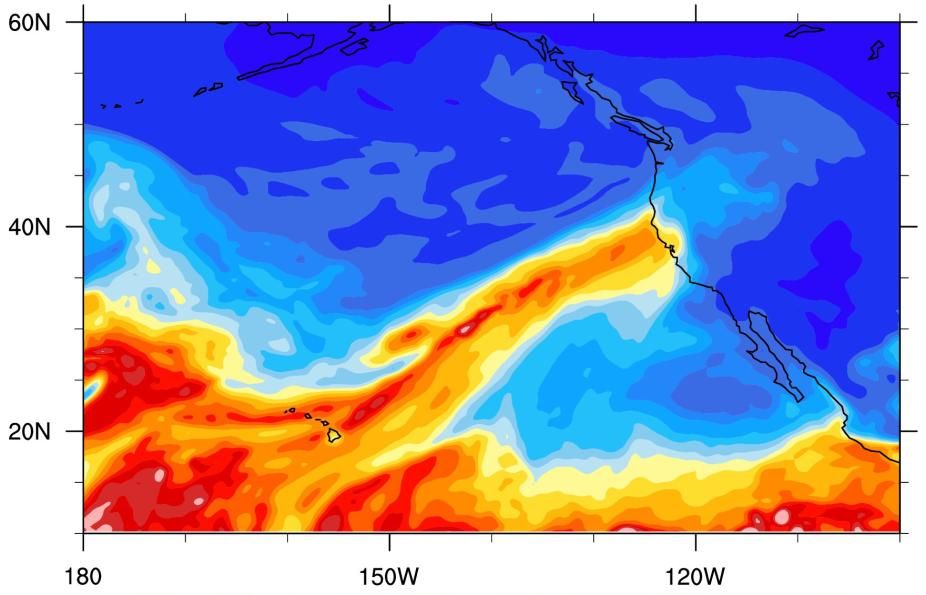

# Experimental Design
ARTMIP provides the framework necessary to compare each of these different algorithms which will ultimately allow independent researchers to understand what types of algorithms are best for specific science questions.

## Tier 1

Participants run their algorithms on a common dataset and adhere to a common format.
<b>Data set</b>: MERRA v2 Reanalysis
<b>Time period for study</b>: 1980 - June 2017
<b>Results</b>: Algorithm output should include timestamp, latitude/longitude, and binary yes (1) or no (0) as to whether or not an AR exists, for each 3-h MERRA time step. Individual catalogs will be compiled by Nov/Dec 2017.

## Tier 2

Similar design as Tier 1, except participants may opt to run algorithms for cross-reanalysis sensitivity studies, or climate change studies. Datasets include high resolution climate change model output (i.e. CAM5 0.25o) and/or other re-analysis products such as CFSR, ERA-I, JRA.

Tier 1 and Tier 2 (where applicable) will include comparisons to precipitation datasets such as TRMM, PERSIANN, GPCP, Livenh, or E-OBS.

## Tier Leads
Christine Shields, NSF NCAR: Experimental Design and Logistics Lead

Jonathan Rutz NWS,CW3E: Tier 1

Ashley Payne U.Michigan: Tier 2 C20C+

Travis O'Brien LNBL, IU: Tier 2 CMIP5/6

Allison Collow NASA,GMAO:  Tier 2 Reanalysis

Juan Lora, Yale:  Tier 2 Paleo
