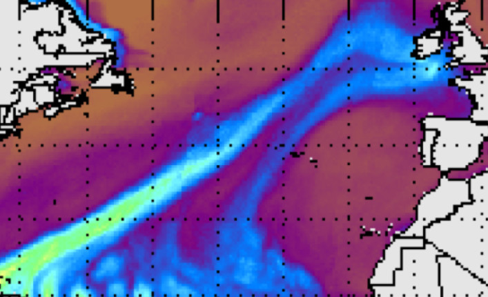

# Atmospheric River Tracking Method Intercomparison Project (ARTMIP)

## What are Atmospheric Rivers (ARs)?
Atmospheric rivers (ARs) are dynamically driven, filamentary structures that account for ~90% of poleward water vapor transport outside of the tropics, despite occupying only ~10% of the available longitude. They are often associated with extreme winter storms and heavy precipitation along the western coasts of mid-latitude continents and have the ability to produce major flooding events and/or relieve droughts. Because ARs play such an important role in the global hydrological cycle as well as to regional water resources, understanding how they may vary from subseasonal-to-interannual time scale and change in a warmer climate is critical to advancing understanding and prediction of regional precipitation.

  <figure style='display: table'>
    
    <figcaption style='display: table-caption; caption-side: bottom;'>Atmospheric River event January 24 05 GMT. One event among many impacting the UK during the winter of 2013/2014.</figcaption>
  </figure>
  <figure class="inline end" >
     
  <figcaption>Fig 2</figcaption>
  </figure>

  Fig 1: Atmospheric River event January 24 05 GMT. One event among many impacting the UK during the winter of 2013/2014.
  Fig 2: Atmospheric River event February 10 00 GMT. The Oroville Dam Crisis, in northern California, occurred during this event in 2017.

| 
Atmospheric River event January 24 05 GMT. One event among many impacting the UK during the winter of 2013/2014.
 | 
Atmospheric River event February 10 00 GMT. The Oroville Dam Crisis, in northern California, occurred during this event in 2017.
 |
| :--- | :--- |
|    |    |

<kbd>   [VIEW SATELLITE IMAGERY SOURCE](https://tropic.ssec.wisc.edu/real-time/mimic-tpw/global/main.html)   </kbd>

Here I need to add some images

## What is the purpose of ARTMIP?
The goal of ARTMIP is to understand and quantify uncertainties in atmospheric river (AR) science based on choice of detection/tracking methodology. The climatological characteristics of ARs, such as AR frequency, duration, intensity, and seasonality, are all strongly dependent on the method used to identify ARs. It is, however, the precipitation attributable to ARs that is perhaps most strongly affected, and this has significant implications for our understanding of how ARs contribute to regional hydroclimate now and in the future.

* Edit `_config.yml` with your title, authors, repo name etc.
* Add new notebooks in the `notebooks` folder
* Add those notebooks into `_toc.yml`

### Collaborators

| Name | Personal goals | Can help with | Role |
| ------------- | ------------- | ------------- | ------------- |
| Katherine J. | I want to learn specific python libraries for working with these data  | I can help with understanding our dataset, programming in R  | Project Lead |
| Rosalind F. | Practice leading a software project | machine learning and python (scipy, scikit-learn) | Project Lead |
| Alan T. | learning about your dataset | GitHub, Jupyter, cloud computing | Project Helper |
| Rachel C. | learn to use github, resolve merge conflicts | I am familiar with our dataset | Team Member  |
| ... | ... | ... | ... |
| ... | ... | ... | ... |

Atmospheric River event January 24 05 GMT. One event among many impacting the UK during the winter of 2013/2014. |  Atmospheric River event February 10 00 GMT. The Oroville Dam Crisis, in northern California, occurred during this event in 2017.
:---:|:---:
  |  
