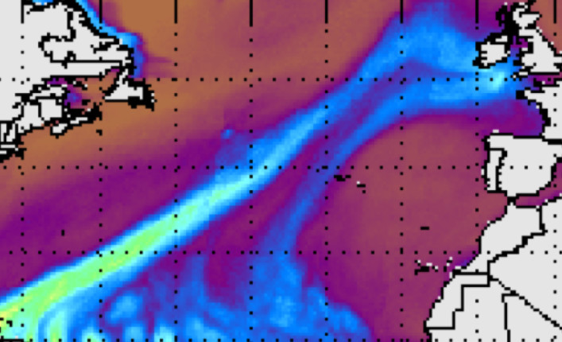
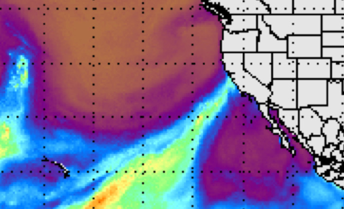
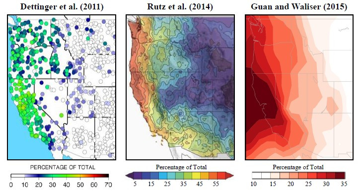
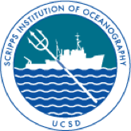

# Atmospheric River Tracking Method Intercomparison Project (ARTMIP)

## What are Atmospheric Rivers (ARs)?
Atmospheric rivers (ARs) are dynamically driven, filamentary structures that account for ~90% of poleward water vapor transport outside of the tropics, despite occupying only ~10% of the available longitude. They are often associated with extreme winter storms and heavy precipitation along the western coasts of mid-latitude continents and have the ability to produce major flooding events and/or relieve droughts. Because ARs play such an important role in the global hydrological cycle as well as to regional water resources, understanding how they may vary from subseasonal-to-interannual time scale and change in a warmer climate is critical to advancing understanding and prediction of regional precipitation.

<!--- This is me trying a different method to not have the images in a table

  <figure style='display: table'>
    
    <figcaption style='display: table-caption; caption-side: bottom;'>Atmospheric River event January 24 05 GMT. One event among many impacting the UK during the winter of 2013/2014.</figcaption>
  </figure>
  <figure class="inline end" >
     
  <figcaption>Fig 2</figcaption>
  </figure>

  Fig 1: Atmospheric River event January 24 05 GMT. One event among many impacting the UK during the winter of 2013/2014.
  Fig 2: Atmospheric River event February 10 00 GMT. The Oroville Dam Crisis, in northern California, occurred during this event in 2017.

--->

<!--- A method to make the images the same size, but feels clunky and won't change size based on screen size
| Atmospheric River event January 24 05 GMT. One event among many impacting the UK during the winter of 2013/2014. | Atmospheric River event February 10 00 GMT. The Oroville Dam Crisis, in northern California, occurred during this event in 2017. |
| :--- | :--- |
|    |    |

 
--->

| Atmospheric River event January 24 05 GMT. One event among many impacting the UK during the winter of 2013/2014. | Atmospheric River event February 10 00 GMT. The Oroville Dam Crisis, in northern California, occurred during this event in 2017. |
| :---: | :---: |
|    |    |

<kbd>
  <a href=https://tropic.ssec.wisc.edu/real-time/mimic-tpw/global/main.html> <b>VIEW SATELLITE IMAGERY SOURCE</b> </a>
  </kbd>

## What is the purpose of ARTMIP?
The goal of ARTMIP is to understand and quantify uncertainties in atmospheric river (AR) science based on choice of detection/tracking methodology. The climatological characteristics of ARs, such as AR frequency, duration, intensity, and seasonality, are all strongly dependent on the method used to identify ARs. It is, however, the precipitation attributable to ARs that is perhaps most strongly affected, and this has significant implications for our understanding of how ARs contribute to regional hydroclimate now and in the future.

The figure above shows (left and center) the fraction of cool-season precipitation attributable to ARs from Dettinger et al. (2011), Rutz et al. (2014). (Right) as in (left and center), but for annual precipitation. These studies use different AR identification methods, as well as different atmospheric re-analyses and observed precipitation datasets.

Scientific focus on ARs has grown exponentially over the last decade, and consequently there are many methods to track them. Quantifying the uncertainties associated with AR tracking methods, and understanding the implications of their differences is the motivation for ARTMIP. The below chart summarizes the many different algorithmic approaches found in current literature by broadly categorizing the variety of parameters used for identification and tracking, and then listing different types of choices available per category.

  <!------>
  
  Algorithm Grid, by Christine Shields

## Committee Members
* **Christine Shields**, Co-chair
* **Jonathan Rutz**, Co-chair
* **Michael Wehner**, Committee member
* **Ruby Leung**, Committee member
* **Marty Ralph**, Committee member
* **Ashley Payne**, Committee member
* **Travis O'Brien**, Committee member
* **Allison Collow**, Committee member

For more information, please contact a committee member.

## ARTMIP Sponsors
Organizing Committee Sponsors are listed below.

<!---

  
   
   
   
   
   
   
   
   

--->
|  |  |  |
| --------------------------------- | ------------------------------------- | ------------------------------------- |
|  |          |            |
|        |          |  |
|      |  |            |
